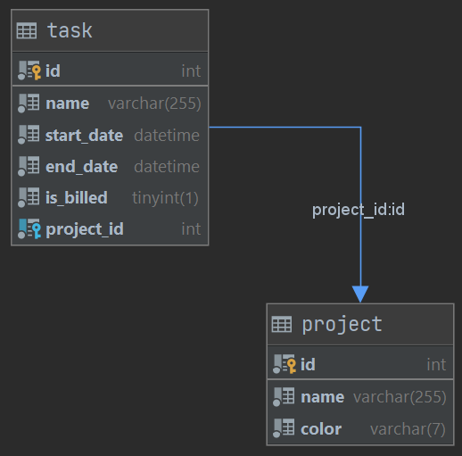

# Usage
## Installation
1. If not already done, [install Docker Compose](https://docs.docker.com/compose/install/)
2. Run `docker-compose up` (the logs will be displayed in the current shell)
3. Open `https://localhost/projects` in your favorite web browser and [accept the auto-generated TLS certificate](https://stackoverflow.com/a/15076602/1352334)

## Quality tools
- To run PHP CS fixer: ```dce php composer cs```
- GrumPHP automatically check your commits. To run it manually, run ```dce php composer grumphp```

# Schema


# Technical choices
## Docker
This project has been created using Docker.  
Docker ensures that the project will run smoothly on any machine.

The [template from Dunglas](https://github.com/dunglas/symfony-docker) has been used as a starting point of this project.

## Fetch
[Fetch API](https://developer.mozilla.org/fr/docs/Web/API/Fetch_API/Using_Fetch) has been used to perform asynchronous requests.  
I chose this technology because it is native and easy to use.

## Water.css
In order to make the website more appealing, I used [Water.css](https://watercss.kognise.dev/).  
This lightweight framework (< 2kB) makes a website beautiful and responsive in seconds.  
It does not use classes so it does not alter a project and can be replaced easily by a more oriented framework.

## Testing
For the moment, only one class has been unit tested.  
The goal of this test is to show how I implement unit tests on my projects.  
Unfortunately, there isn't much business logic on this project so there is not a lot of unit tests.

Functional tests have not been added to this project in order to be more efficient.  
Although, on an actual project, I would have allocated time to add functional tests for controllers and repositories.
